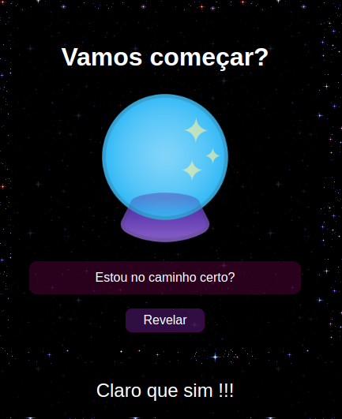

# Bola de Cristal 🔮

Bem-vindo à Bola de Cristal, uma aplicação simples que permite ao usuário fazer perguntas do tipo sim ou não e receber respostas aleatórias e misteriosas. 

## Como Funciona 🕹️

1. Acesse a [Bola de Cristal](https://boladecristal.herokuapp.com/).

2. Digite uma pergunta de sim ou não na caixa de texto e pressione "Perguntar".

3. A Bola de Cristal irá fornecer uma resposta misteriosa e aleatória para a sua pergunta.

4. Você pode fazer quantas perguntas quiser e receber respostas diferentes a cada vez.

## Tecnologias Utilizadas 🚀

Este projeto foi desenvolvido utilizando as seguintes tecnologias:

- **HTML**: Utilizado para criar a estrutura da página da web.
- **CSS**: Para estilizar a página e dar uma aparência mágica à Bola de Cristal.
- **JavaScript**: Para criar a lógica por trás da geração de respostas aleatórias.

Divirta-se fazendo perguntas à Bola de Cristal e recebendo respostas misteriosas! Lembre-se de que a Bola de Cristal é apenas uma brincadeira e as respostas são geradas aleatoriamente.

## Screenshots

## Contribuições 💪

Se você deseja contribuir para este projeto, sinta-se à vontade para abrir problemas (issues) ou enviar solicitações de pull (pull requests) no repositório do projeto.

## Licença 📜

Este projeto está licenciado sob a Licença MIT. Consulte o arquivo [LICENSE](LICENSE) para obter mais detalhes sobre os termos da licença.
